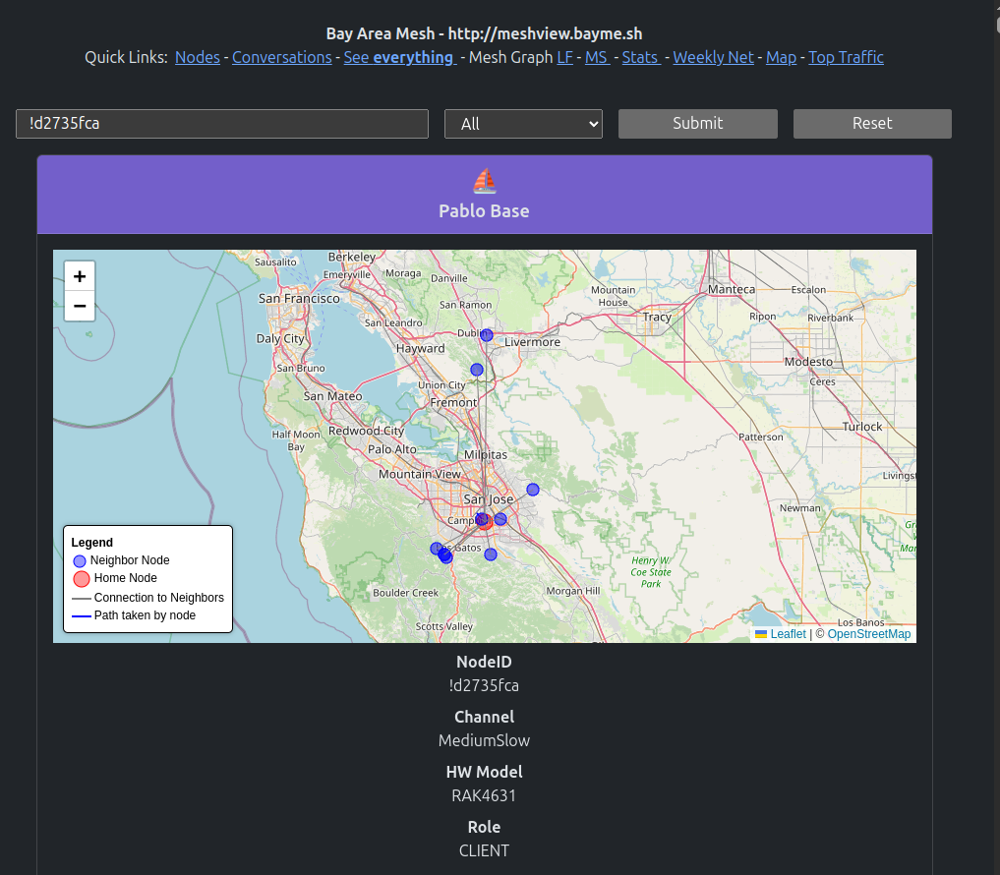

# Meshview

This project watches a MQTT topic for meshtastic messages, imports them to a
database and has a web UI to view them.

An example of a currently running instace for the San Francisco Bay Area mesh runs at https://meshview.bayme.sh

Requires **`python3.11`** or above.

## Preparing

Clone the repo from github with:
``` bash 
git clone --recurse-submodules https://github.com/pablorevilla-meshtastic/meshview.git
```
> [!NOTE]
> It is important to include the `--recurse-submodules` flag or the meshtastic protobufs won't be included.

Create a python virtual environment:
``` bash
cd meshview
```
``` bash
python3 -m venv env
```
Install the environment requirements:
``` bash
./env/bin/pip install -r requirements.txt
```
You also need to install `graphviz`:
``` bash
sudo apt-get install graphviz
```
Copy `sample.config.ini` to `config.ini`:
``` bash
cp sample.config.ini config.ini
```
 Edit `config.ini` and change the MQTT server, and Web server settings as necsessary.
 ```bash
 nano config.ini
 ``` 
```ini
[server]
bind = *
port = 8081
tls_cert = 
acme_challenge = 

[site]
domain = http://meshview.bayme.sh
title = Bay Area Mesh
message =

[mqtt]
server = mqtt.bayme.sh
topics = ["msh/US/bayarea/#", "msh/US/CA/mrymesh/#"] 
port = 1883
username = meshdev
password = large4cats

[database]
connection_string = sqlite+aiosqlite:///packets.db
```

## Running Meshview
Start the database connection.
``` bash
./env/bin/python startdb.py
```
Start the web server.
``` bash
./env/bin/python main.py
```


Now you can hit http://localhost:8081/ ***(if you did not change the web server port )***

You can specify the path to your `config.ini` file with the run command argument `--config`
``` bash
./env/bin/python startdb.py --config /path/to/config.ini
./env/bin/python main.py --config /path/to/config.ini
```
