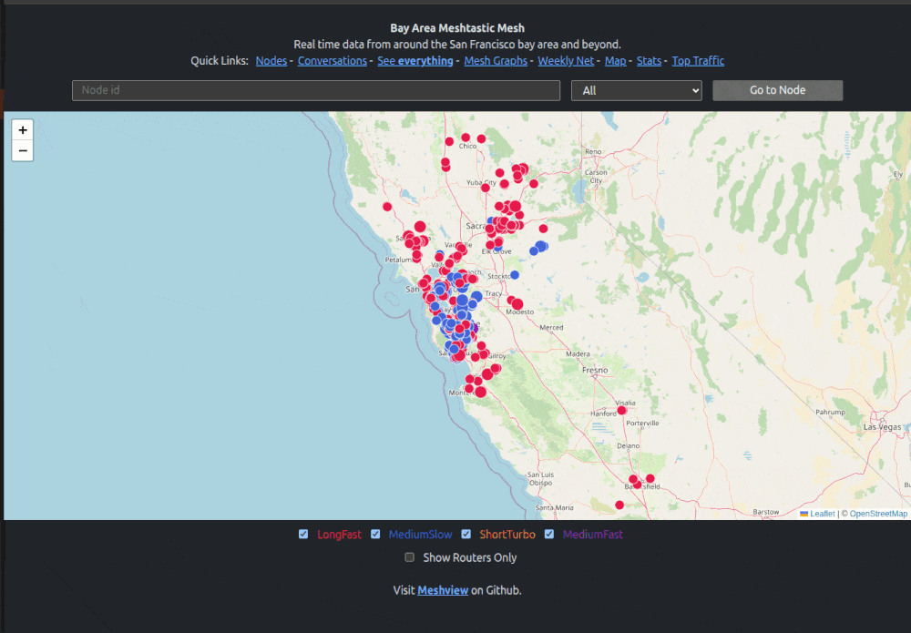

# Meshview


The project serves as a real-time monitoring and diagnostic tool for the Meshtastic mesh network. It provides detailed insights into network activity, including message traffic, node positions, and telemetry data.

### Version 2.0.7 update - September 2025
* New database maintenance capability to automatically keep a specific number of days of data.
* Added configuration for update intervals for both the Live Map and the Firehose pages.

### Version 2.0.6 update - August 2025
* New Live Map (Shows packet feed live)
* New API /api/config (See API documentation)
* New API /api/edges (See API documentation)
* Adds edges to the map (click to see traceroute and neighbours)

### Version 2.0.4 update - August 2025
* New statistic page with more data.
* New API /api/stats (See API documentation).
* Inprovement on "See Everything" and "Conversation" pages.
* Tracking of replies with links to original message.

### Version 2.0.3 update - June 2025
* Moved more graphs to eCharts.
* Addedd smooth updating for "Conversations" and "See everything" sections.
* Now you can turn on and off "Quick Links".
* Network graphs are now dynamically generated depending on your mesh and the presets in use.
* Download node's packet information for the last 3 days to .csv file.
* Display distance traveled by packet.
### Key Features

* **Live Data Visualization**: Users can view real-time data from the mesh network, including text messages, GPS positions, and node information.

* **Interactive Map**: The site offers an interactive map displaying the locations of active nodes, helping users identify network coverage areas.

* **Mesh Graphs**: Visual representations of the network's structure and connectivity are available, illustrating how nodes are interconnected.

* **Packet Analysis**: Detailed information on individual data packets transmitted within the network can be accessed, including payload content and transmission paths.

* **Node Statistics**: Users can explore statistics related to network traffic, such as top contributors and message volumes.

Samples of currently running instances:

- https://meshview.bayme.sh (SF Bay Area)
- https://www.svme.sh (Sacramento Valley)
- https://meshview.nyme.sh   (New York)
- https://meshview.socalmesh.org (LA Area)
- https://map.wpamesh.net (Western Pennsylvania)
- https://meshview.chicagolandmesh.org (Chicago)
- https://meshview.mt.gt (Canadaverse)
- https://meshview.meshtastic.es (Spain)
- https://view.mtnme.sh (North Georgia / East Tennessee)
- https://meshview.lsinfra.de (Hessen - Germany)
- https://map.nswmesh.au (Sydney - Australia)
- https://meshview.pvmesh.org (Pioneer Valley, Massachusetts)
- https://meshview.louisianamesh.org (Louisiana)
---

## Installing

Requires **`python3.11`** or above.

Clone the repo from GitHub:

```bash
git clone https://github.com/pablorevilla-meshtastic/meshview.git
```

```bash
cd meshview
```
Create a Python virtual environment:

from the meshview directory...
```bash
uv venv env || python3 -m venv env
```

Install the environment requirements:

```bash
uv pip install -r requirements.txt || ./env/bin/pip install -r requirements.txt
```

Install `graphviz` on MacOS or Debian/Ubuntu Linux:

```bash
[ "$(uname)" = "Darwin" ] && brew install graphviz
[ "$(uname)" = "Linux" ] && sudo apt-get install graphviz
```

Copy `sample.config.ini` to `config.ini`:

```bash
cp sample.config.ini config.ini
```

Edit `config.ini` to match your MQTT and web server settings:


```bash
nano config.ini
```

> **NOTE**
> On MacOS set the bind configuration line to 
> ```
> bind = 127.0.0.1
> ```

Example:

```ini
# -------------------------
# Server Configuration
# -------------------------
[server]
# The address to bind the server to. Use * to listen on all interfaces.
bind = *

# Port to run the web server on.
port = 8081

# Path to TLS certificate (leave blank to disable HTTPS).
tls_cert =

# Path for the ACME challenge if using Let's Encrypt.
acme_challenge =


# -------------------------
# Site Appearance & Behavior
# -------------------------
[site]
# The domain name of your site.
domain =

# Site title to show in the browser title bar and headers.
title = Bay Area Mesh

# A brief message shown on the homepage.
message = Real time data from around the bay area and beyond.

# Starting URL when loading the index page.
starting = /chat

# Enable or disable site features (as strings: "True" or "False").
nodes = True
conversations = True
everything = True
graphs = True
stats = True
net = True
map = True
top = True

# Map boundaries (used for the map view).
# Defaults will show the San Francisco Bay Area
map_top_left_lat = 39
map_top_left_lon = -123
map_bottom_right_lat = 36
map_bottom_right_lon = -121

# Updates intervals in seconds, zero or negative number means no updates
# defaults will be 3 seconds
map_interval=3
firehose_interval=3

# Weekly net details
weekly_net_message = Weekly Mesh check-in. We will keep it open on every Wednesday from 5:00pm for checkins. The message format should be (LONG NAME) - (CITY YOU ARE IN) #BayMeshNet.
net_tag = #BayMeshNet

# -------------------------
# MQTT Broker Configuration
# -------------------------
[mqtt]
# MQTT server hostname or IP.
server = mqtt.bayme.sh

# Topics to subscribe to (as JSON-like list, but still a string).
topics = ["msh/US/bayarea/#", "msh/US/CA/mrymesh/#", "msh/US/CA/sacvalley"]

# Port used by MQTT (typically 1883 for unencrypted).
port = 1883

# MQTT username and password.
username = meshdev
password = large4cats


# -------------------------
# Database Configuration
# -------------------------
[database]
# SQLAlchemy connection string. This one uses SQLite with asyncio support.
connection_string = sqlite+aiosqlite:///packets.db


# -------------------------
# Database Cleanup Configuration
# -------------------------
[cleanup]
# Enable or disable daily cleanup
enabled = False
# Number of days to keep records in the database
days_to_keep = 14
# Time to run daily cleanup (24-hour format)
hour = 2
minute = 00
# Run VACUUM after cleanup
vacuum = False
```

---

## Running Meshview

Start the database manager:

```bash
./env/bin/python startdb.py
```

Start the web server:

```bash
./env/bin/python main.py
```

> **NOTE**  
> You can specify a custom config file with the `--config` flag:
>
> ```bash
> ./env/bin/python startdb.py --config /path/to/config.ini
> ./env/bin/python main.py --config /path/to/config.ini
> ```

Open in your browser: http://localhost:8081/

---

## Running Meshview with `mvrun.py`

- `mvrun.py` starts both `startdb.py` and `main.py` in separate threads and merges the output.
- It accepts the `--config` argument like the others.

```bash
./env/bin/python mvrun.py
```

---

## Setting Up Systemd Services (Ubuntu)

To run Meshview automatically on boot, create systemd services for `startdb.py` and `main.py`.
> **NOTE**  
> You need to change the "User" and "/path/to/meshview" for your instance of the code on each service.

### 1. Service for `startdb.py`

Create:

```bash
sudo nano /etc/systemd/system/meshview-db.service
```

Paste:

```ini
[Unit]
Description=Meshview Database Initializer
After=network.target

[Service]
Type=simple
WorkingDirectory=/path/to/meshview
ExecStart=/path/to/meshview/env/bin/python /path/to/meshview/startdb.py --config /path/to/meshview/config.ini
Restart=always
RestartSec=5
User=yourusername

[Install]
WantedBy=multi-user.target
```

### 2. Service for `main.py`

Create:

```bash
sudo nano /etc/systemd/system/meshview-web.service
```

Paste:

```ini
[Unit]
Description=Meshview Web Server
After=network.target meshview-db.service

[Service]
Type=simple
WorkingDirectory=/path/to/meshview
ExecStart=/path/to/meshview/env/bin/python /path/to/meshview/main.py --config /path/to/meshview/config.ini
Restart=always
RestartSec=5
User=yourusername

[Install]
WantedBy=multi-user.target
```

### 3. Enable and start the services

```bash
sudo systemctl daemon-reexec
sudo systemctl daemon-reload
sudo systemctl enable meshview-db
sudo systemctl enable meshview-web
sudo systemctl start meshview-db
sudo systemctl start meshview-web
```

### 4. Check status

```bash
systemctl status meshview-db
systemctl status meshview-web
```

**TIP**  
After editing `.service` files, always run:

```bash
sudo systemctl daemon-reload
```

## 5. Database Maintenance
### Database maintnance can now be done via the script itself here is the section from the configuration file.
- Simple to setup
- It will not drop any packets
```
# -------------------------
# Database Cleanup Configuration
# -------------------------
[cleanup]
# Enable or disable daily cleanup
enabled = False
# Number of days to keep records in the database
days_to_keep = 14
# Time to run daily cleanup (24-hour format)
hour = 2
minute = 00
# Run VACUUM after cleanup
vacuum = False
```
Once changes are done you need to restart the script for changes to load.

### Alternatively we can do it via your OS 
- Create and save bash script below. (Modify /path/to/file/ to the correct path)
- Name it cleanup.sh
- Make it executable.
```bash
 #!/bin/bash

DB_FILE="/path/to/file/packets.db"


# Stop DB service
sudo systemctl stop meshview-db.service
sudo systemctl stop meshview-web.service

sleep 5
echo "Run cleanup..."
# Run cleanup queries
sqlite3 "$DB_FILE" <<EOF 
DELETE FROM packet WHERE import_time < datetime('now', '-14 day');
DELETE FROM packet_seen WHERE import_time < datetime('now', '-14 day');
DELETE FROM traceroute WHERE import_time < datetime('now', '-14 day');
DELETE FROM node WHERE last_update < datetime('now', '-14 day') OR last_update IS NULL OR last_update = '';
VACUUM;
EOF

# Start DB service
sudo systemctl start meshview-db.service
sudo systemctl start meshview-web.service

echo "Database cleanup completed on $(date)"

```
- Schedule running the script on a regular basis. 
- In this example it runs every night at 2:00am.

Open scheduler:
```bash
sudo crontab -e
```
Add schedule to the bottom of the file (modify /path/to/file/ to the correct path):
```bash
0 2 * * * /path/to/file/cleanup.sh >> /path/to/file/cleanup.log 2>&1
```

Check the log file to see it the script run at the specific time.


