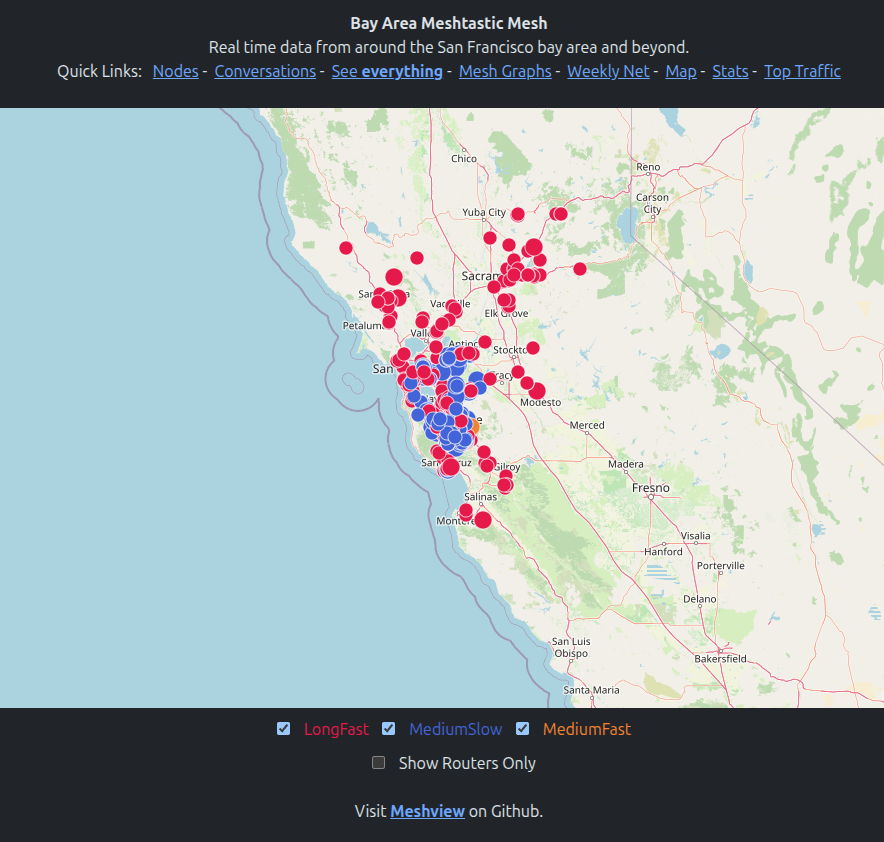

# Meshview


This project watches a MQTT topic for meshtastic messages, imports them to a
database and has a web UI to view them.

Samples of currently running instances:

- https://meshview.bayme.sh   (SF Bay Area)
- https://nyme.sh   (New York)
- https://socalmesh.w4hac.com  (Southern California)
- https://meshview.mt.gt (Canadaverse)
- https://meshview.meshtastic.es (Spain)
- https://view.azmsh.net  (Arizona)

---

## Preparing

Requires **`python3.11`** or above.

Clone the repo from GitHub:

```bash
git clone --recurse-submodules https://github.com/pablorevilla-meshtastic/meshview.git
```

> **NOTE**  
> It is important to include the `--recurse-submodules` flag or the meshtastic protobufs won't be included.

Create a Python virtual environment:

```bash
cd meshview
python3 -m venv env
```

Install the environment requirements:

```bash
./env/bin/pip install -r requirements.txt
```

Install `graphviz`:

```bash
sudo apt-get install graphviz
```

Copy `sample.config.ini` to `config.ini`:

```bash
cp sample.config.ini config.ini
```

Edit `config.ini` to match your MQTT and web server settings:

```bash
nano config.ini
```

Example:

```ini
# Server Details
[server]
bind = *
port = 8081
tls_cert =
acme_challenge =

# Site Details
[site]
domain = https://www.bayme.sh
title = Bay Area Mesh
message = Real time data from around the bay area and beyond.

# Quick links enablement on site
nodes=True
conversations=True
everything=True
graphs=True
stats=True
net=True
map=True
top=True

# Map structure
map_top_left_lat=39
map_top_left_lon=-123
map_bottom_right_lat=36
map_bottom_right_lon=-121

# Note about how your weekly mesh runs. time and tag used for the system to track.
weekly_net_message= Weekly Mesh check-in. We will keep it open on every Wednesday from 5:00pm for checkins. The message format should be (LONG NAME) - (CITY YOU ARE IN) #BayMeshNet.
net_tag=#BayMeshNet

# MQTT Server configuration
[mqtt]
server = mqtt.bayme.sh
topics = ["msh/US/bayarea/#", "msh/US/CA/mrymesh/#", "msh/US/CA/sacvalley" ]
port = 1883
username = meshdev
password = large4cats

# Database configuration
[database]
connection_string = sqlite+aiosqlite:///packets.db
```

---

## Running Meshview

Start the database:

```bash
./env/bin/python startdb.py
```

Start the web server:

```bash
./env/bin/python main.py
```

> **NOTE**  
> You can specify a custom config file with the `--config` flag:
>
> ```bash
> ./env/bin/python startdb.py --config /path/to/config.ini
> ./env/bin/python main.py --config /path/to/config.ini
> ```

Open in your browser: http://localhost:8081/

---

## Running Meshview with `mvrun.py`

- `mvrun.py` starts both `startdb.py` and `main.py` in separate threads and merges the output.
- It accepts the `--config` argument like the others.

```bash
./env/bin/python mvrun.py
```

---

## Setting Up Systemd Services (Ubuntu)

To run Meshview automatically on boot, create systemd services for `startdb.py` and `main.py`.
> **NOTE**  
> You need to change the "User" and "/path/to/meshview" for your instance of the code on each service.

### 1. Service for `startdb.py`

Create:

```bash
sudo nano /etc/systemd/system/meshview-db.service
```

Paste:

```ini
[Unit]
Description=Meshview Database Initializer
After=network.target

[Service]
Type=simple
WorkingDirectory=/path/to/meshview
ExecStart=/path/to/meshview/env/bin/python /path/to/meshview/startdb.py --config /path/to/meshview/config.ini
Restart=always
RestartSec=5
User=yourusername

[Install]
WantedBy=multi-user.target
```

### 2. Service for `main.py`

Create:

```bash
sudo nano /etc/systemd/system/meshview-web.service
```

Paste:

```ini
[Unit]
Description=Meshview Web Server
After=network.target meshview-db.service

[Service]
Type=simple
WorkingDirectory=/path/to/meshview
ExecStart=/path/to/meshview/env/bin/python /path/to/meshview/main.py --config /path/to/meshview/config.ini
Restart=always
RestartSec=5
User=yourusername

[Install]
WantedBy=multi-user.target
```

### 3. Enable and start the services

```bash
sudo systemctl daemon-reexec
sudo systemctl daemon-reload
sudo systemctl enable meshview-db
sudo systemctl enable meshview-web
sudo systemctl start meshview-db
sudo systemctl start meshview-web
```

### 4. Check status

```bash
systemctl status meshview-db
systemctl status meshview-web
```

> **TIP**  
> After editing `.service` files, always run:
>
> ```bash
> sudo systemctl daemon-reload
> ```

